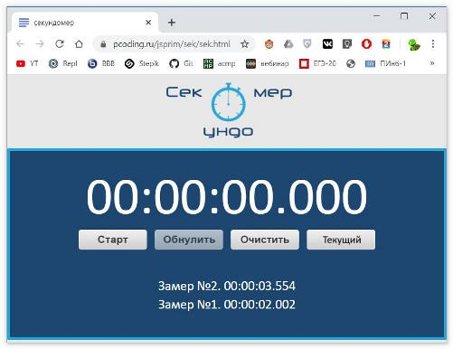

## Pygame  
### 27.04.2020 - 03.05.2020  

---  

Как установить Pygame  
Pygame не входит в стандартную библиотеку Python и требует отдельной установки.
```  
Для Linux:  
python3 -m pip install -U pygame --user  
или  
sudo apt-get install python3-pygame  
Для Windows:  
py -m pip install -U pygame --user  
```  

---  

Часть 1 - Тетрис квадратиками  
1) добавить смену цветов (6 штук)  
2) добавить ПАУЗУ (например, клавишей SPACE)  
3) добавить опускание сразу вниз блока при нажатии стрелки вниз  
4) добавить запрет вставания на уже существующие блоки  
5) добавить остановку игры - проигрыш - после заполнения стакана  

---  

[Документация](https://www.pygame.org/docs/)  
[Курс по PyGame на youtube](https://youtu.be/wDgZdYRQ4gU)  

---  


**ЛабРаб Часть 1 28.04.2020**  
_ТЕХНИЧЕСКОЕ ЗАДАНИЕ_  

Простое задание - нужно на Питоне сделать секундомер с обработкой клавиатурных событий.  
Прототип программы есть в вашем репозитории по текущей теме - example-ticks.py.  
А пример-аналог (только на JS) можно увидеть тут: https://pcoding.ru/jsprim/sek/sek.html  
Желательно (для определённости) использовать такие клавиши:  
* SPACE - старт/стоп  
* ENTER - обнулить таймер  
* ESCAPE - очистить поле замеров  
* BACKSPACE - зафиксировать замер без остановки таймера  

  


---  


