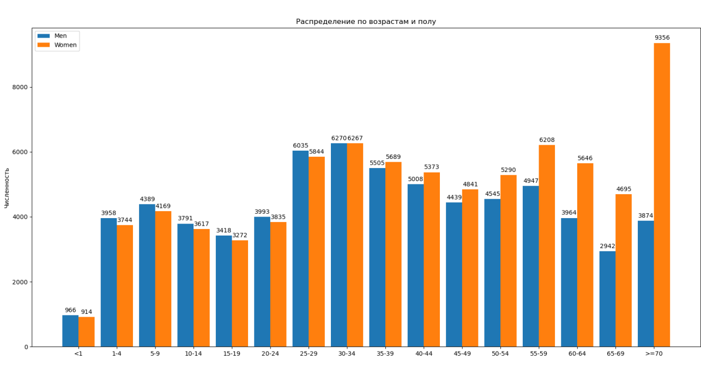

## Графики функций и данных

[Видео - График за 5 минут и 10 строчек кода](https://youtu.be/qLjHgUwLOrs)

[Видео - График за 10 минут и 20 строчек кода](https://youtu.be/t3LloJzKiRE)

[Пример построения групповой диаграммы](https://matplotlib.org/gallery/lines_bars_and_markers/barchart.html#sphx-glr-gallery-lines-bars-and-markers-barchart-py)

[Учебник PythonJunior, Глава G, Как построить график функции](https://pcoding.ru/pdf/PythonJunior.pdf)

---

В текущей папке лежит файл **"Население-по-возрастам.txt"** с распределением населения РФ по возрастам и полу.

**Задание**:

- взять данные из этого файла и построить групповую диаграмму как показано на скриншоте (лежит в текущей папке - **"example.png"**) 
- за основу возьмите пример программы построения групповой диаграммы (см. выше)
- в программе следует поменять названия осей и название диаграммы - перевести на русский
- установить пропорции диаграммы по умолчанию при запуске (см. видео "5 минут") 
- данные для построения читать из файла при запуске программы, начиная с третьей строки, бить по полям, и необходимые поля добавлять в соответствующие списки для построения.

---

